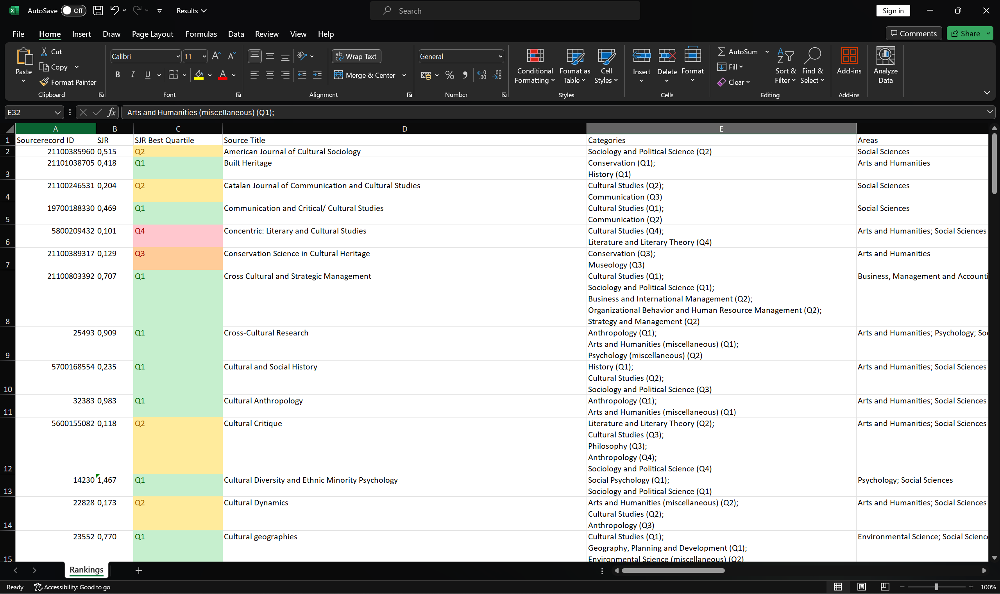

# <p align="center">Scopus Parser </p>

### 🔬 Overview
The **Scopus Parser** is a Python tool designed for researchers to filter, map, and rank academic journals. It bridges the gap between the raw **Scopus Source List** and **SCImago Journal Rankings (SJR)**, providing a clean, color-coded Excel report with human-readable subject areas and quartile rankings.

---

## 🚀 Key Features
* **Intelligent Subject Mapping**: Automatically converts 4-digit ASJC codes into readable field names (e.g., `1206` -> `Conservation`).
* **SCImago Integration**: Merges SJR data using `Sourcerecord ID` vs `Sourceid` for precise ranking.
* **Multi-Keyword Filtering**: Supports complex searches across titles and fields.
* **Professional Reporting**: Generates auto-fitted Excel files with:
    * **Conditional Formatting**: Q1–Q4 color-coding (Green to Red).
    * **Multi-line Cells**: Subject categories are split by newlines for readability.
    * **Clean Metadata**: Removes unnecessary Scopus columns automatically.

---

## 📂 Data Setup (Required Files)

To use this tool, you must place two specific files in the `scopus` folder:

### 1. Scopus Source List (`.xlsx`)
* **Source**: Visit the [Scopus Source Page](https://www.scopus.com/sources).
* **How to get it**: Click on **"Download Scopus Source List"**.
* **Requirement**: This script expects the ASJC code mapping to be present in the last sheet of the workbook.

### 2. SCImago Journal Rank (`.csv`)
* **Source**: Visit [SCImago Journal Rank](https://www.scimagojr.com/journalrank.php).
* **How to get it**: Click the **"Download data"** button.
* **Requirement**: Ensure you download the **CSV** format. The script uses the `Sourceid` column to match rankings.

---

## 📊 Sample Output


---

## 🛠️ Installation & Setup

### 1. Install Python
Ensure you have **Python 3.8 or higher** installed. Download it from [python.org](https://www.python.org/downloads/). 
**Note:** You can use the new Python Install Manager for easier setup. If you choose to manually install python, ensure "Add Python to PATH" is checked during installation.

### 2. Setup the python environment
Open your terminal or command prompt in the project folder and run:

```bash
python -m venv env
./env/Scripts/activate
```

### 3. Install Dependencies
Open your terminal or command prompt in the project folder and run:

```bash
pip install -r requirements.txt
```

## 💻 Usage

Run the client via the command line using the following arguments:

```bash
python main.py --keywords "Heritage Conservation" "Science" --source_types Journal --active_status Active --output_filename Results.xlsx
```

### Argument Reference

| Argument | Description | Example |
| :--- | :--- | :--- |
| `--keywords` | List of terms to search for. Supports multiple keywords and regex. | `--keywords "Heritage" "Conservation"` |
| `--source_types` | Filter by the type of publication (Journal, Book Series, etc.). | `--source_types Journal` |
| `--active_status` | Filter journals by their current status (Active or Inactive). | `--active_status Active` |
| `--output_filename`| The name of the generated Excel report. Must end in `.xlsx`. | `--output_filename results.xlsx` |

---

## ⚖️ Disclaimer
This tool is for academic research purposes. Ensure you comply with Elsevier and SCImago terms of service when downloading and processing their data.